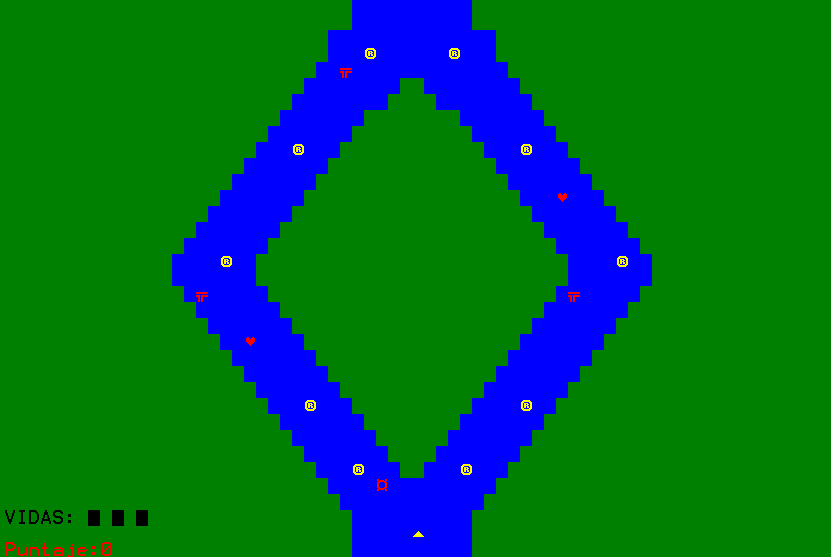
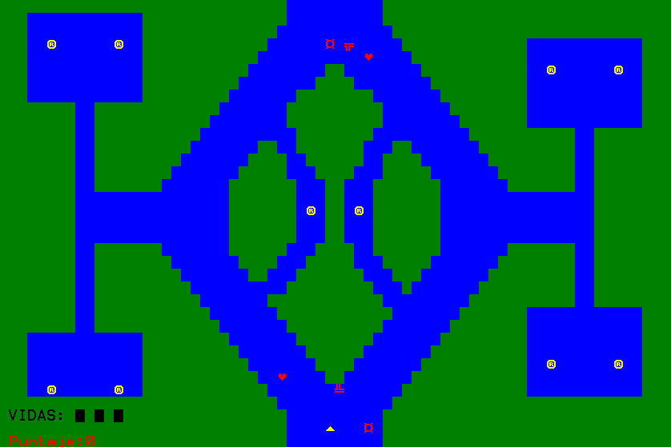

# River Raid 
---
### Game based on the Atari River Raid game and developed as a final project of the programming 1 subject at UPC

#### Instructions:
- Move ship with W A S D keys 
- Shoot with SPACE key
- You need to collect all the points in the map in order to change level

---

---
Made by <a href = "https://github.com/RodrigoAGM">@RodrigoAGM </a> :smile:
